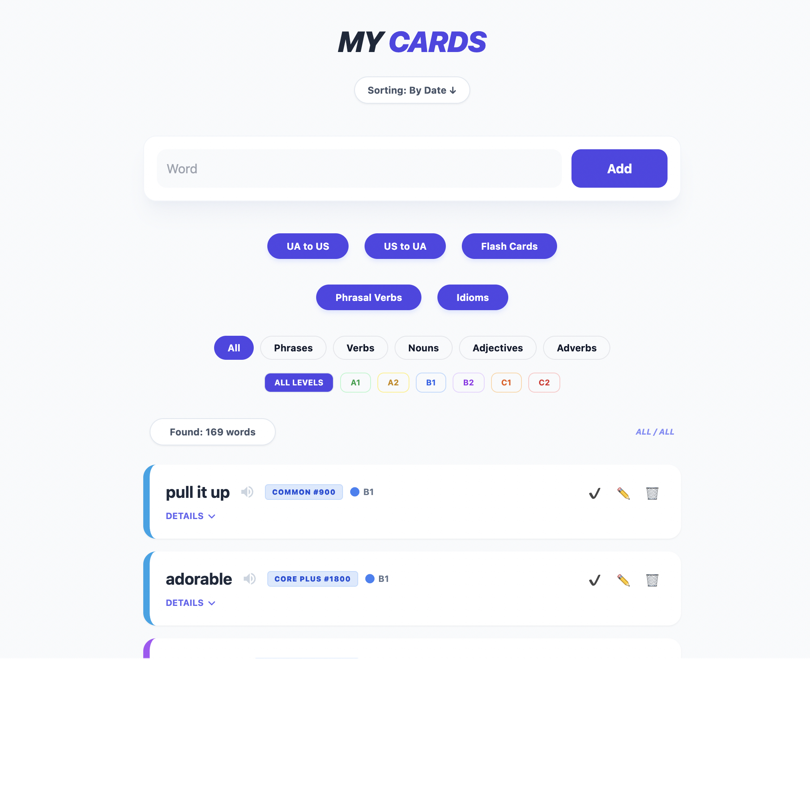
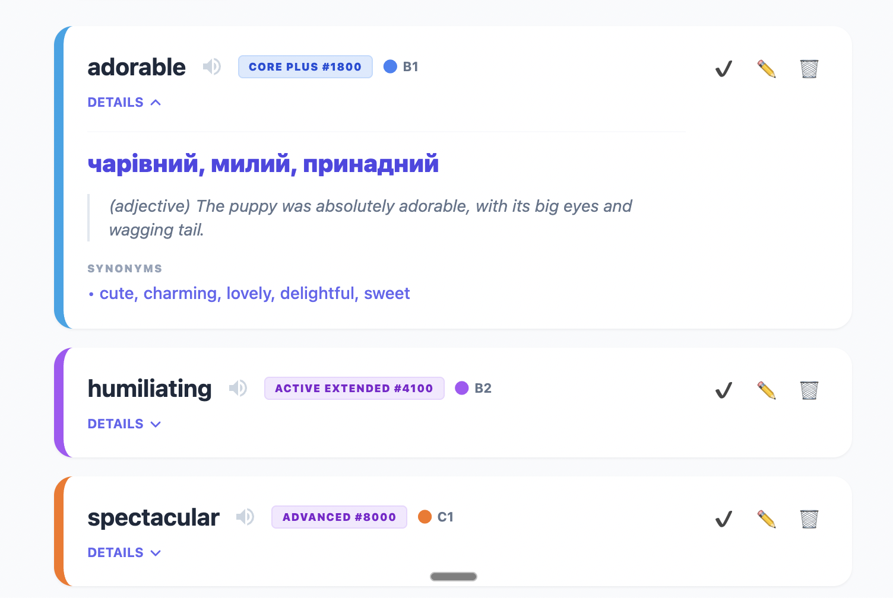

# EasyVocab 🚀

> An intelligent AI-powered English vocabulary builder that makes learning new words and phrasal verbs effortless.

## What is EasyVocab?

EasyVocab is a smart learning companion designed to streamline vocabulary acquisition. By leveraging **Google Gemini AI**, it automatically enriches every word you add with Ukrainian translations, real-life usage examples, CEFR level classifications, and frequency rankings. Whether you're learning everyday vocabulary, phrasal verbs, or idioms, EasyVocab helps you track progress and master English at your own pace.

## ✨ Key Features

### 🤖 Smart Word Enrichment
- **Auto-generated translations**: Get instant Ukrainian translations for every word
- **Contextual examples**: Learn through real-life usage scenarios
- **Synonym suggestions**: Expand your vocabulary with related words
- **AI-powered**: All metadata generated automatically using Google Gemini

### 📊 Progress Tracking
- **CEFR leveling**: Words categorized from A1 (beginner) to C2 (advanced)
- **Frequency rankings**: Visual badges showing word rarity (Core 500, Active Basic, Rare, etc.)
- **Learned status**: Mark words as mastered to track your progress

### 📚 Comprehensive Learning Tools
- **Phrasal verb explorer**: Study phrasal verbs grouped by root (get, take, look, go)
- **Idiom collection**: Learn common idiomatic expressions with examples
- **Interactive flashcards**: Test yourself with UA→EN and EN→UA quiz modes
- **Audio pronunciation**: Hear correct pronunciation with text-to-speech

### 🎨 User Experience
- **Clean, minimalist design**: Focus on what matters—learning
- **Mobile-friendly**: Learn on any device
- **Color-coded difficulty**: Quick visual cues for word complexity
- **Fast and responsive**: Built with modern web technologies

## 📸 App Screenshots

| Main Dashboard | Phrasal Verbs Explorer | Word Card Details | Flashcard Mode |
|:---:|:---:|:---:|:---:|
|  |  |  |  |
| View all your words in a clean, organized list with progress tracking. | Explore phrasal verbs grouped by root verbs (get, take, look, go) with contextual examples. | See detailed information for each word including translations, examples, and synonyms. | Test your knowledge with interactive flashcards in both UA→EN and EN→UA modes. |

## 🚀 Development Approach

This project was built using **AI-assisted development** with **Google Gemini AI** as a key contributor. Rather than writing boilerplate code and configuration manually, Gemini helped accelerate development by:

- Shaping the application architecture
- Refining core business logic
- Polishing the user interface
- Suggesting best practices and optimizations

This approach allowed for rapid iteration while focusing on delivering an excellent vocabulary learning experience.

## 🛠️ Tech Stack

- **Backend**: Python, FastAPI, SQLModel (SQLite).
- **AI Engine**: Google Gemini Pro (via `google-genai` SDK).
- **Frontend**: Tailwind CSS, Vanilla JavaScript.
- **Templating**: Jinja2.

## 🚀 Getting Started

### Prerequisites

- Python 3.12+
- Google Gemini API Key (get it at [Google AI Studio](https://aistudio.google.com/))

### Installation

1. **Clone the repository**:
   ```bash
   git clone https://github.com/borys25ol/easy-vocab.git
   cd easy-vocab
   ```

2. **Set up a virtual environment**:
   ```bash
   python -m venv .ve
   source .ve/bin/activate
   ```

3. **Install dependencies**:
   ```bash
   pip install -r requirements.txt
   ```

4. **Configure Environment Variables**:
   Create a `.env` file or export the variable directly:
   ```bash
   export GOOGLE_API_KEY='your_api_key_here'
   ```

### Running the App

Start the FastAPI server using the provided `Makefile` or directly via `uvicorn`:

```bash
# Using Makefile
make runserver

# OR directly
uvicorn app.main:app --reload
```

## 🤖 MCP Server Integration

This project includes an **MCP (Model Context Protocol) server** that allows AI assistants to directly add words to your vocabulary database.

### Features

- **Single `add_word` tool** - Simply provide a word and let AI handle translations, examples, and metadata
- Uses FastMCP for clean, Pythonic implementation
- HTTP transport on port 6432 for easy integration

### Installation

MCP requires the `fastmcp` package (already in `requirements.txt`):

```bash
pip install fastmcp==2.2.10
```

### Running the MCP Server

```bash
python mcp_server.py
```

The server will start on `http://localhost:6432`

### Available Tools

| Tool | Description |
|------|-------------|
| `add_word(word: str)` | Add a new word with auto-generated translations, examples, and metadata |
